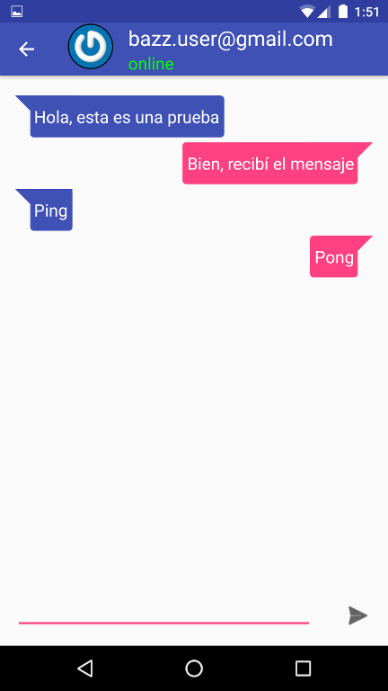

# Android Firebase Chat

Un chat simple en Android utilizando Firebase como base de datos de tiempo real para intercambiar los mensajes y para la autenticación de los usuarios.

Para que funcione, se debe crear un proyecto en [Firebase](https://www.firebase.com/) y activar Android para generar un archivo __google-services.json__, este archivo se copia dentro de la carpeta app

Para agregar Firebase a tu app: https://firebase.google.com/docs/android/setup

## Estructura

La capa de presentación se organiza utilizando [MVP](http://antonioleiva.com/mvp-android) + [Clean](https://8thlight.com/blog/uncle-bob/2012/08/13/the-clean-architecture.html).

Las imagenes de perfil de los usuarios se obtienen de Gravatar utilizando la librería [Glide](https://github.com/bumptech/glide).

Los eventos se envían entre las capas de la arquitectura usando [EvenBus] (https://github.com/greenrobot/EventBus).

Para la autenticación, crear usuarios y enviar mensajes entre las aplicaciones se utiliza [Firebase] (https://www.firebase.com)

TODO:
* Pruebas
* Inyectar dependencias mediante [Dagger2](https://github.com/google/dagger) 

## Pantallas:

* [Login](./screenshots/1-login.png)
* [Agregar contacto](./screenshots/2-add_contact.png)
* [Lista de contactos](./screenshots/3-user_list.png)
* [Chat](./screenshots/4-chat.png)
